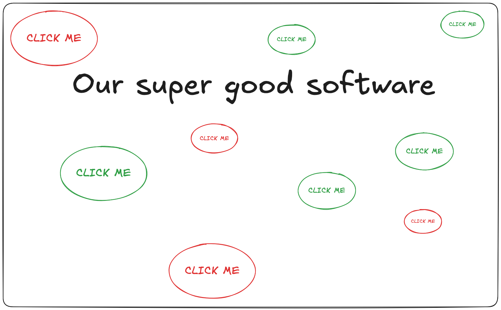

We will soon release a new version of OpenStatus. We are discussing with Max which metrics we should track to understand if the new version performs better. We are using [OpenPanel](https://openpanel.dev/) for our product analytics.

We concluded that we are both software engineers and that our product design should be driven by good taste.

If it looks and feels great to use, it will grow through word of mouth.

However, building a product only based on conversion rate metrics may result in a Christmas Tree software.

